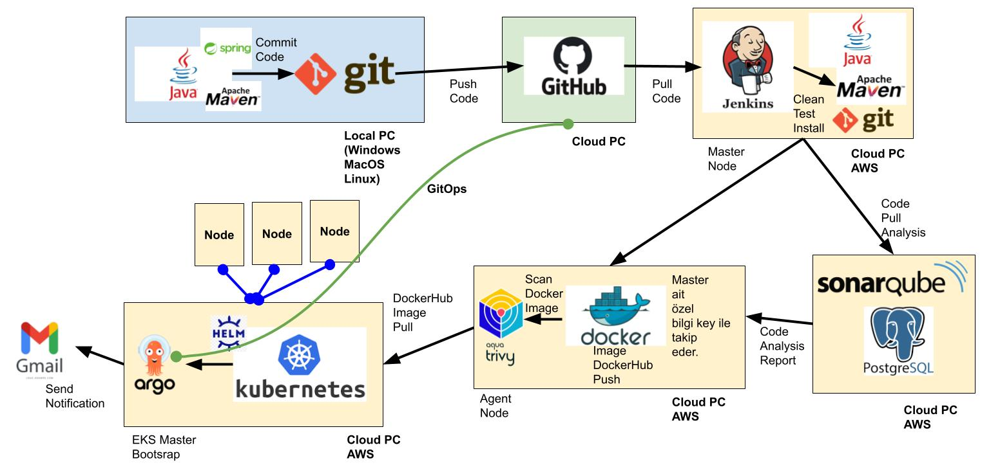
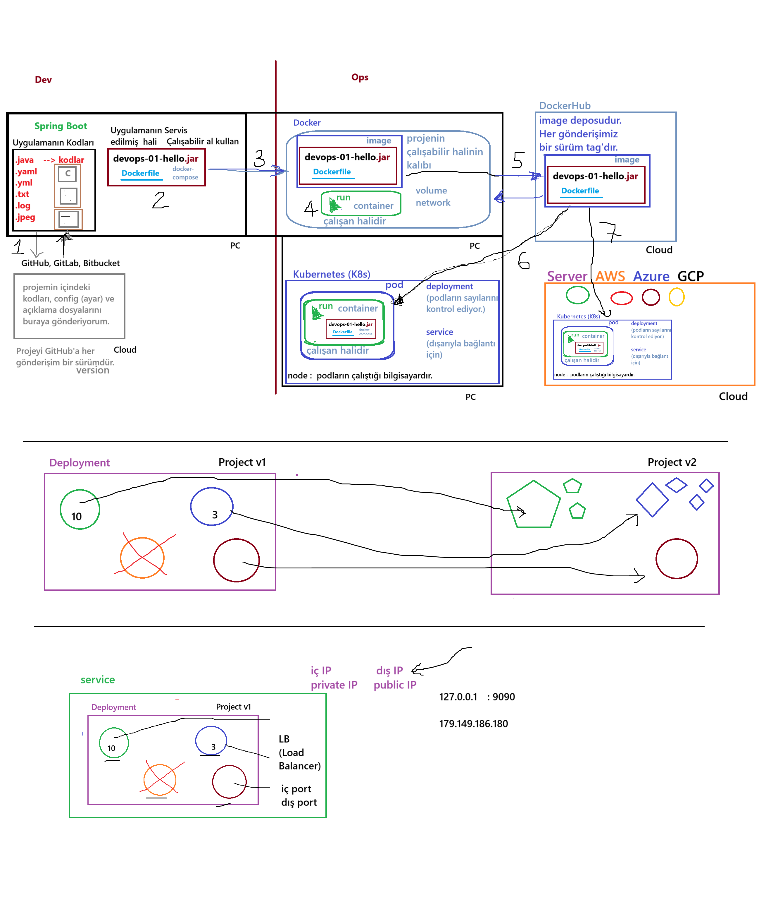
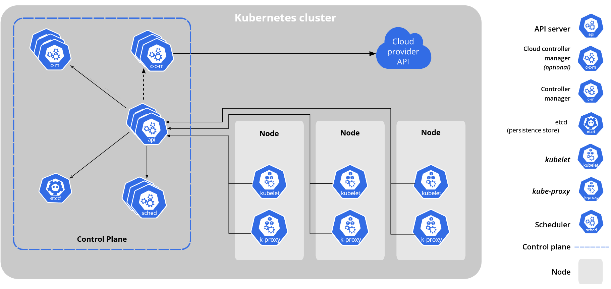

### Dockerfile ve Image Yapısı 🚀

#### Image Seçimi ve Etiketleme 🏷️

* Docker imajımı özenle seçtim ve sürekli güncel, stabil bir base image kullanmayı tercih ettim, böylece her deploy sürecinde sürpriz hatalarla karşılaşmaktan kaçındım ve sistemin sürekliliğini garanti altına aldım. 🔄📦
* Her image için anlamlı ve anlaşılır bir tag kullanıyorum, bu sayede rollback gerektiğinde hangi versiyona dönmem gerektiğini net bir şekilde biliyorum ve bu strateji tüm deploy sürecimi daha öngörülebilir kılıyor. ⏪🔧
* Image etiketlerini güncel tutmak, build pipeline’ının her adımında tutarlılık sağlıyor ve devops sürecini hem hızlı hem de güvenli kılıyor. ⚡🧩
* Avantajı, hızlı deploy ve sürüm kontrolü sağlamak; dezavantajı ise tag’leri doğru yönetmezsen eski sürümlere dönüş zorlaşabilir. ⚖️💡

#### Port ve Resource Limitleri ⚡

* Container içinde uygulamayı 8080 portunda çalıştırıyorum ve CPU ile hafıza limitlerini belirliyorum, böylece pod’lar cluster’ı zorlamıyor ve performans her zaman stabil kalıyor. 🧠💪
* Limitler sayesinde aşırı resource tüketimi engelleniyor, aynı zamanda diğer pod’ların performansı da korunuyor, bu da yüksek erişilebilirlik sağlıyor. 🔗🌟
* Dezavantaj olarak, limitleri çok sıkı tutarsam büyük yük altında uygulama throttling yaşayabilir; bu yüzden dengeyi iyi kurmak gerekiyor. ⚖️🛠️
* Avantajı ise sistemin öngörülebilir ve kontrollü çalışması, kaynak israfının önlenmesi. ✅🚀

#### Container Adlandırması ve Yönetimi 🏗️

* Her container’a anlamlı bir isim verdim, loglarda ve yönetimde karışıklık olmaması için, böylece hangi container’ın hangi servisle ilişkili olduğunu anında görebiliyorum. 👀📝
* İsimlendirme stratejisi, özellikle multi-container ve multi-deploy senaryolarında operasyonel karmaşayı azaltıyor ve troubleshooting süreçlerini hızlandırıyor. ⚡🔍
* Dezavantajı, isimlendirme kurallarına dikkat edilmezse ilerleyen projelerde tutarsızlık yaratabilir; bu yüzden standart belirlemek kritik. ⚖️🧩
* Avantajı, hem operasyonel verim hem de görsel takip kolaylığı sağlaması. 🌟💪

### Jenkinsfile ve Pipeline Yönetimi 🛠️

#### Agent ve Ortam Değişkenleri 🤖🌿

* Pipeline’i belirli bir agent üzerinde çalıştırıyorum, bu sayede kaynaklar tahsis ediliyor ve build süreci belirli bir ortamda tutarlı bir şekilde gerçekleşiyor. ⚡🧠
* APP_NAME gibi environment değişkenleri kullanmak, tüm stage’lerde aynı referansı sağlayarak hem tutarlılık hem de hata riskini azaltıyor. 🔗✨
* Dezavantajı, agent tek ve sınırlı ise yüksek paralel job’larda darboğaz oluşturabilir; avantajı ise kontrollü ve öngörülebilir build ortamı sunması. 🛡️🚀
* Böyle bir yapı, özellikle production pipeline’larında güvenliği ve repeatability’yi artırıyor. ✅🔒

#### Workspace Temizliği ve SCM Checkout 🧹🌐

* cleanWs() ile çalışma alanını temizliyorum, bu sayede eski build dosyaları yeni build’i etkilemiyor ve her build temiz bir başlangıç yapıyor. ✨🧽
* scmGit ile GitHub’dan main branch’i çekmek, pipeline’ın her zaman güncel ve senkron bir kod üzerinde çalışmasını sağlıyor, böylece deployment süreci güvenli ve hatasız ilerliyor. 🔄💻
* Dezavantajı, büyük repo’larda checkout süresi uzayabilir; avantajı ise build reproducibility ve kod tutarlılığı sağlamak. ⚡🧩
* Bu strateji, rollback ve versiyon kontrolünü de kolaylaştırıyor, çünkü her zaman master branch’e bağlıyız. ⏪🔧

#### Deployment Tag Güncelleme ve Sed Kullanımı 🏷️🔧

* `sed -i` ile deployment.yaml içindeki image tag’ini güncelliyorum, böylece yeni build doğru versiyonu kullanıyor ve hatalı deploy riskini azaltıyor. 🏗️📄
* Bu yöntem sayesinde sürüm yükseltmeleri otomatik ve hızlı oluyor, manuel hataları minimize ediyor ve pipeline’ı daha güvenli kılıyor. ⚡🧠
* Dezavantajı, sed komutu yanlış kullanılırsa dosyada bozulma riski; avantajı ise hızlı ve otomatik güncelleme imkanı. ✅🔍
* Her deploy sonrası tag’lerin güncellenmesi, rollback ve sürüm takibini kolaylaştırıyor. ⏪🌟

#### Git Push ve Credential Yönetimi 🔑📤

* Push işlemlerinde Jenkins credential kullanıyorum, böylece güvenlik risklerini minimize ediyorum ve token’lar maskelenmiş oluyor. 🔒🚀
* Detached HEAD kontrolü ile branch’e geçiş sağlanıyor, commit yoksa hata vermiyor ve pipeline’in devam etmesi garantileniyor. 🌿🔄
* Dezavantajı, credential yönetimi dikkat edilmezse güvenlik açığı oluşabilir; avantajı ise pipeline güvenliği ve stabil push süreci. ⚡🧩
* Bu yapı sayesinde rollback senaryoları güvenle uygulanabilir ve hatalı deployment sonrası eski sürüme hızlıca dönülebilir. ⏪🛡️

### Kubernetes Deployment ve Service Yapısı 🌍

#### Deployment Konfigürasyonu 🏗️

* Deployment’da pod sayısını, etiketleri ve container portlarını belirliyorum; replica sayısı ile yükü paylaştırıyor ve yüksek erişilebilirlik sağlıyorum. ⚡🧠
* Dezavantajı, çok fazla replica cluster kaynaklarını tüketebilir; avantajı ise uygulamanın yük altında bile erişilebilir kalması. 💪🔍
* Etiketleme ve selector uyumu, Service ile entegre çalışmayı garantiliyor ve trafik doğru şekilde yönlendiriliyor. 🔗🚀
* Bu yapı, özellikle roll-out ve roll-back süreçlerinde güvenli ve kontrol edilebilir bir ortam sağlıyor. ⏪🛡️

#### Resource Limitleri ve Container Yönetimi 🛡️

* Memory ve CPU limitleri ile pod’ların cluster’ı zorlamasını önlüyorum, böylece diğer servisler etkilenmiyor ve sistem stabil kalıyor. ⚡🧠
* Dezavantajı, limitler çok sıkı olursa uygulama throttling yaşayabilir; avantajı ise kaynak kullanımının öngörülebilir olması. ✅💪
* Container isimlendirme ve yönetimi, multi-container senaryolarında troubleshooting sürecini hızlandırıyor. 👀🔍
* Bu yaklaşım, hem operasyonel verim hem de güvenli yönetim sağlıyor. 🌟🛠️

#### Service ve Selector Uyumları 🔗

* Service selector’ü deployment pod’larıyla eşleşiyor ve portlar birebir uyumlu; LoadBalancer ile dış erişim mümkün oluyor, böylece uygulama her yerden erişilebilir. 🌐🚀
* Dezavantajı, yanlış selector veya port eşleşmesi deployment’ı erişilemez kılabilir; avantajı ise doğru yapılandırıldığında yüksek erişilebilirlik ve yönetim kolaylığı sağlaması. 🛡️⚡
* ClusterIP alternatifi ile internal-only erişim de mümkün, bu da güvenlik ve network segmentasyonu sağlar. 🔒🌿
* Bu yapı, rollback senaryolarında Service trafiğinin güvenli ve kontrollü olmasını da garanti ediyor. ⏪🛡️

#### Rollback ve Güvenlik Önlemleri ⏪🛡️

* Pipeline ve Kubernetes yapılandırması, hatalı deploy sonrası rollback yapılabilecek şekilde tasarlandı, böylece sistem her zaman kararlı durumda kalıyor. ⚡🌟
* Dezavantajı, rollback süreci otomatik değilse manuel müdahale gerekebilir; avantajı ise hatalı deployment’ların hızlıca geri alınabilmesi. ✅🧩
* Güvenlik önlemleri, credential yönetimi, resource limitleri ve branch kontrolü ile birleşince pipeline hem stabil hem de güvenli hale geliyor. 🔒🚀
* Bu yaklaşım, uzun vadede sistemin sürdürülebilirliğini ve operasyonel verimliliğini artırıyor. 🌿💪

### Görseller:

---

---

